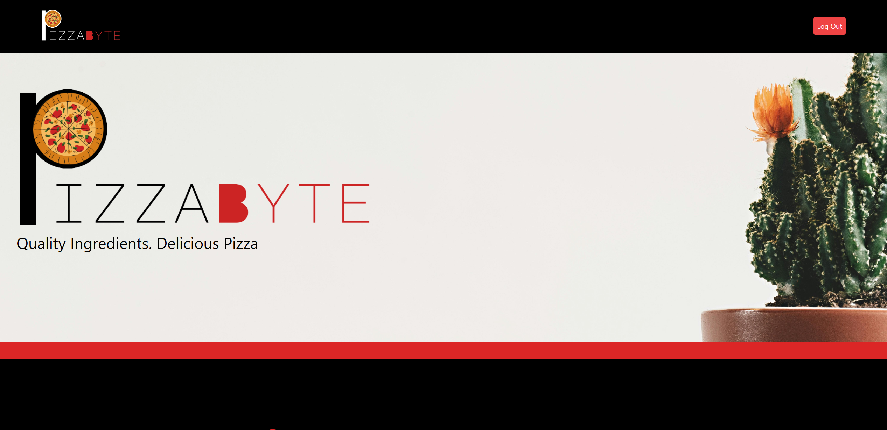

# PizzaByte - README

## Table of Contents
- [Overview](#overview)
- [Technology](#technology)
  - [Frontend](#frontend)
  - [Backend](#backend)
  - [Deployment](#deployment)
  - [Automated Testing](#automated-testing)
- [Running and Testing Locally](#running-and-testing-locally)
  - [Prerequisites](#prerequisites)
  - [Installing Dependencies](#installing-dependencies)
  - [Environment Variables](#environment-variables)
  - [Testing](#testing)
  - [Code Management](#code-management)
  - [Running Application/Migrating and Seeding Databases](#running-applicationmigrating-and-seeding-databases)
- [Future Development and Improvements](#future-development-and-improvements)
- [Credits](#credits)

## Overview

### PizzaByte is a full-stack application built to manage menus and ingredients inventory for pizza restaurants, providing an easy to use platform for both owners and chefs.



PizzaByte allows owners to log in to their owner accounts and choose what toppings are available in their restuarant by adding new toppings and updating/removing existing toppings. Duplicate toppings are not allowed. These toppings are used to create "Classics" - customized pizzas that have a specific set of toppings. Chefs can log in using their chef accounts and create their own Classic, or update/remove existing Classic. Classic names must be unique, and no two Classics can have the same set of toppings. Users can log in to their user accounts, however, there is no functionality yet for users. That being said, the platform is set up to eventually allow users to order pizzas.

[Return to Top](#table-of-contents)


## Technology

_Here are the technologies used to develop this application:_

### Frontend

- React.js
- Tailwind CSS
- React Router Dom (for client side routing)
- React Hot Toasts
- React Icons
- JWT Decoder (for Auth Tokens)

[Return to Top](#table-of-contents)

<span style="color: red;">NOTE:</span> Although Tailwind CSS is used for styling, all frontend designs are my own. The logo was also of my own design using Canva. All images used are royalty free.

### Backend

- Node.js
- Express
- MySQL/Sequelize
- JSON Web Token (for stateless Auth)
- Winston (for improved logging)

[Return to Top](#table-of-contents)

### Deployment

This application is deployed via Heroku, and both production database and test database are hosted by JAWS DB.
Visit the deployed site <a href="https://toacins-pizza-byte-855681cbecff.herokuapp.com/" target="_blank">here</a>.

[Return to Top](#table-of-contents)

### Automated Testing

This application uses the Jest testing framework for both the frontend and backend due to its wide usage in Javascript ecosystems, ease of use, and feature-rich set of tools. Testing is automated with Github through Github Actions, where tests are ran on all pull requests into the `main` branch. Instructions for running tests locally below.

[Return to Top](#table-of-contents)

## Running and Testing Locally

### Prerequisites

- Node.js (version 16.x or higher)
- npm (version 6.x or higher)
- MySQL

[Return to Top](#table-of-contents)

### Installing Dependencies

On your terminal, clone the repository or a forked repository, and cd to said repository. Next, install all dependencies.

```
npm install
```

This will install both frontend and backend dependencies.

[Return to Top](#table-of-contents)

### Environment Variables

Only the backend for this application requires environment variables. A template is provided to help and also included below:

```
# Database
DB_USER =
DB_PASSWORD =
DB_DATABASE =
DB_HOST =
DB_PORT =

# JWT
JWT_SECRET =

# Server
PORT =
```

`JWT_Secret` _and_ `PORT` _can be anything of your choice (among accepted values for server ports)_

<span style="color: red;">NOTE:</span> If you plan to make contributions or pull requests to a forked repository, be aware that Github Secrets environment variables must be added. Here is a <a href="https://docs.github.com/en/actions/security-for-github-actions/security-guides/using-secrets-in-github-actions" target="_blank">guide</a> on how to do this. The following secrets are required:

```
JAWSDB_URL
GH_SECRET_USER
GH_SECRET_HOST
GH_SECRET_DATABASE
GH_SECRET_PASSWORD
GH_SECRET_PORT
JWT_SECRET
```

[Return to Top](#table-of-contents)

### Testing

To run tests locally, run the following commands from the root level of the application:

```
npm run test
```

This will initiate testing for the backend first, and then the frontend. Alternatively, the same commaned can be ran while within either the frontend or backend directories to run their respective tests indpendently. Test coverage data is displayed and subsequently logged in a `coverage` directory found in both frontend and backend directories.

[Return to Top](#table-of-contents)

### Code Management

This codebase uses eslint and prettier to keep code uniform. To format new code, run the following command at the root level of the application:

```
npm run format
```

Run the following command to check all formatting:
```
npm run lint
```

[Return to Top](#table-of-contents)

### Running Application/Migrating and Seeding Databases

Run the following command to run the application locally in a development environment:

```
npm run dev
```

<span style="color: red;">NOTE:</span>  Running this command will first initiate database migrations, and subsequently database seeding. Feel free to remove that from the script if this is not a desired behavior. The following command can be ran from the backend directory to migrate or seed the database without starting the application. 

```
npm run migrate
npm run migrateTestDb // for test database
npm run seed
npm run seedTestDb // for test database
```

[Return to Top](#table-of-contents)

## Future Development and Improvements

As stated earlier, this application is set up to eventually take orders from regular users. While not implemented since out of scope, the project is open to future contributions. Here is the working <a href="https://github.com/users/Toacin/projects/2" target="_blank">project board</a> for this application with issues outline ways to improve and progress the development of PizzaByte.

[Return to Top](#table-of-contents)

## Credits

Logo designed by myself on Canva.
Images are royalty free from pexels.

[Return to Top](#table-of-contents)